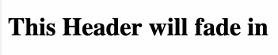

# Conductor (conductor-animate)
> Orchestrating complex page layout animations with a flick of the wrist.

[![NPM Version][npm-image]][npm-url]
[![Downloads Stats][npm-downloads]][npm-url]
[](https://bundlephobia.com/result?p=conductor-animate)
[](https://bundlephobia.com/result?p=conductor-animate)
[](https://taekimjr.github.io/conductor-animate/)

Conductor is a React animation library that makes it easier to coordinate animations across your
layout from a single, simple configuration. Coordinating complex page layout animations is now
simple and easy.

We provide some animations [out-of-the-box](#out-of-the-box-animations-source), but the Conductor
System is animation library-agnostic so you can create your own custom animations and inject them
in.

## Installation
npm:

```sh
npm install conductor-animate
```

yarn:

```sh
yarn add conductor-animate
```

## Basic Usage
```javascript
import React from 'react';
import { Conductor, Animated } from 'conductor-animate';
import { Fade } from 'conductor-animate/animations';

// Define the Animation mapping
const animations = { Fade };

// Define the configuration
const config = {
  "HeaderSection": {
    animation: 'Fade',
    duration: 500,
    delay: 200,
  },
};

const App = () => {
  // Render the Page w/ the Conductor and Animated
  return (
    <Conductor animations={animations} config={config}>
      <Animated id="HeaderSection">
        <h1>This Header will fade in</h1>
      </Animated>
    </Conductor>
  );
};

export default App;
```



## Demos
Checkout our [Storybook](https://taekimjr.github.io/conductor-animate/) for live demos!


## Documentation
### Conductor ([source](https://github.com/TaeKimJR/conductor-animate/blob/master/src/Conductor.jsx))
Conducts all nested Animated wrappers by providing directions on how to animate. Be sure that your
Conductor wraps all Animated wrappers that you are expecting to animate.

*Example*
```javascript
<Conductor animations={animations} config={config}>
  <Animated id="HeaderSection" additional={{ index: 0 }}>
    ...
  </Animated>
  <Animated id="BodySection" additional={{ index: 1 }}>
    ...
  </Animated>
  <Animated id="FooterSection" additional={{ index: 2 }}>
    ...
  </Animated>
</Conductor>
```

#### "animations" prop
The "animations" prop is a mapping of animations that are used by the Conductor and live within the
given "config". Be sure to keep this map as narrowed down as much as possible to avoid shipping
unnecessary animations to your app. We also recommend creating this mapping outside of your render
method to cut down on re-renders.

*Shape*
```
{
  [animation: string]: ComponentType,
}
```
- `animation`: The animation name paired with the Animation component.

*Example*
```javascript
{
  Fade: Fade,
  Flip: Flip,
  Shrink: Shrink,
  Slide: Slide,
  CustomAnimation: CustomAnimation,
}
```

#### "config" prop
The "config" prop defines the directions for how each Animated wrapper should animate. The config
can be of two types, an object or a function.

##### Simple (object)
For simple, straightforward animations, use an object "config". For each Animate wrapper nested
within the Conductor, you will need to specify a configuration for all IDs. You will receive an
error if you miss one!

*Shape*
```
{
  [id: string]: {
    animation: string,
    [option: string]: any
  }
}
```
- `id`: The ID of a nested Animated. All Animated wrappers must have an associated config.
- `animation`: The name that maps directly to an animation in the "animations" mapping.
- `option`: Additional props that are passed to the Animation. You can define as many options as are
required/allowed by the Animation.

*Example*
```javascript
{
  HeadingSection: {
    animation: 'Fade',
  },
  ContentSection: {
    animation: 'Fade',
    duration: 1000,
  },
  FooterSection: {
    animation: 'Fade',
    duration: 1000,
    delay: 500,
  },
}
```

##### Advanced (function)
For advanced and complex animations, you can use a function "config". The function takes in the
Animated ID and additional data and should then return the config for that given Animated wrapper.

*Shape*
```
(id: string, additional: object) => ({
  animation: string,
  [option: string]: any
})
```
- `id`: The ID of the Animated component.
- `additional`: Any additional information that can be passed to identify a specific Animated.
(e.g. index)
- `animation`: The name that maps directly to an Animation in the "animations" mapping.
- `option`: Additional props that are passed to the Animation. You can define as many options as
needed.

*Example*
```javascript
(id, additional) => {
  if (id === 'HeadingSection') {
    return { animation: 'Fade' };
  }

  if (additional.index === 1) {
    return {
      animation: 'Fade',
      duration: 1000,
    };
  }

  return {
    animation: 'Fade',
    duration: 1000,
    delay: 500,
  };
}

```

### Animated ([source](https://github.com/TaeKimJR/conductor-animate/blob/master/src/Animated.jsx))
A wrapper component that will apply an animation to its inner contents. It will receive directions
from the Conductor on which Animation to use and how to use it.

*Example*
```
<Conductor animations={animations} config={config}>
  ...
  <Animated id="AnimatedSection" additional={{ index: 0 }}>
    <div>
      I WILL ANIMATE!!!
    </div>
  </Animated>
  ...
</Conductor>
```

#### "id" prop
Each Animated wrapper must be given an "id" prop. The ID must have an associated configuration in
the "config".

*Shape*

`String`

*Example*

`"HeadingSection"`

#### "additional" prop
When the "config" provided to the Conductor is a function, you can pass additional information about
an Animated wrapper through the "additional" prop. The "config" function can use this information to make more specific decisions on how the Animated should animate.

*Shape*
```
{
  [additional: string]: any
}
```

*Example*
```javascript
{
  index: 0,
}
```

### Animation
Within the Conductor System, an Animation is a wrapper component that applies some styles/logic to
its content. This can be done in any way that the Animation chooses.

*Example*
```javascript
<Fade duration={1500} delay={500}>
  <div>I WILL ANIMATE!!!</div>
</Fade>
```

Conductor is compatible with all Animation libraries as long as it animates using a wrapper
component.

*Common Animation Libraries*
- [react-transition-group](https://github.com/reactjs/react-transition-group) ([demo](https://taekimjr.github.io/conductor-animate/?path=/story/concert--unison))
- [react-spring](https://www.react-spring.io) ([demo](https://taekimjr.github.io/conductor-animate/?path=/story/third-party-concerts-react-spring--basic-fade))
- [react-animations](http://react-animations.herokuapp.com/) ([demo](https://taekimjr.github.io/conductor-animate/?path=/story/third-party-concerts-react-animations--basic-fade))

#### Passing props to an Animation
The Animation can receive additional options that are defined in the "config". For example, if
you have the following config...

```javascript
{
  animation: 'Fade',
  duration: 1500,
  delay: 500,
}
```

`duration` and `delay` are additional options and will be passed to the `Fade` Animation as props like so...
```javascript
<Fade duration={1500} delay={500}>
```

#### Out-Of-The-Box Animations ([source](https://github.com/TaeKimJR/conductor-animate/tree/master/src/animations))
The Conductor library ships with some Animations that you can use directly.

**Fade** ([source](https://github.com/TaeKimJR/conductor-animate/blob/master/src/animations/Fade.jsx), [demo](https://taekimjr.github.io/conductor-animate/?path=/story/animations-fade--fade))

Fades the content in.

Options
- `duration`: how long the animation should take (ms)
- `delay`: how long the animation should wait until starting (ms)

Example Config
```
{
  animation: 'Fade',
  duration: 5000,
  delay: 1000,
}
```

**Slide** ([source](https://github.com/TaeKimJR/conductor-animate/blob/master/src/animations/Slide.jsx), [demo](https://taekimjr.github.io/conductor-animate/?path=/story/animations-slide--slide))

Slides the content in.

Options
- `duration`: how long the animation should take (ms)
- `delay`: how long the animation should wait until starting (ms)

Example Config
```
{
  animation: 'Slide',
  duration: 5000,
  delay: 1000,
}
```

**Flip** ([source](https://github.com/TaeKimJR/conductor-animate/blob/master/src/animations/Flip.jsx), [demo](https://taekimjr.github.io/conductor-animate/?path=/story/animations-flip--flip))

Rotates the content in (similar to flipping a coin).

Options
- `duration`: how long the animation should take (ms)
- `delay`: how long the animation should wait until starting (ms)

Example Config
```
{
  animation: 'Flip',
  duration: 5000,
  delay: 1000,
}
```

**Shrink** ([source](https://github.com/TaeKimJR/conductor-animate/blob/master/src/animations/Shrink.jsx), [demo](https://taekimjr.github.io/conductor-animate/?path=/story/animations-shrink--shrink))

Shrinks the content into position.

Options
- `duration`: how long the animation should take (ms)
- `delay`: how long the animation should wait until starting (ms)

Example Config
```
{
  animation: 'Shrink',
  duration: 5000,
  delay: 1000,
}
```

## Meta

Tae Kim – [@taekimjr](https://github.com/TaeKimJR) – taekimjr@gmail.com

Distributed under the MIT license. See ``LICENSE`` for more information.

[https://github.com/TaeKimJR/conductor/blob/master/LICENSE](https://github.com/TaeKimJR/conductor/blob/master/LICENSE)

## Contributing

1. Fork it (<https://github.com/TaeKimJR/conductor/fork>)
2. Create your feature branch (`git checkout -b feature/fooBar`)
3. Commit your changes (`git commit -am 'Add some fooBar'`)
4. Push to the branch (`git push origin feature/fooBar`)
5. Create a new Pull Request

<!-- Markdown link & img dfn's -->
[npm-image]: https://img.shields.io/npm/v/conductor-animate.svg?style=flat-square
[npm-url]: https://npmjs.org/package/conductor-animate
[npm-downloads]: https://img.shields.io/npm/dm/conductor-animate.svg?style=flat-square

## Publishing a new version to NPM
1. Update the version ([semver](https://semver.org/))
```
npm version 1.2.3
```

2. Push to master
```
git push origin master v1.2.3
```

3. Publish
```
npm publish
```

4. Deploy the latest Storybook
```
npm run deploy-storybook
```
